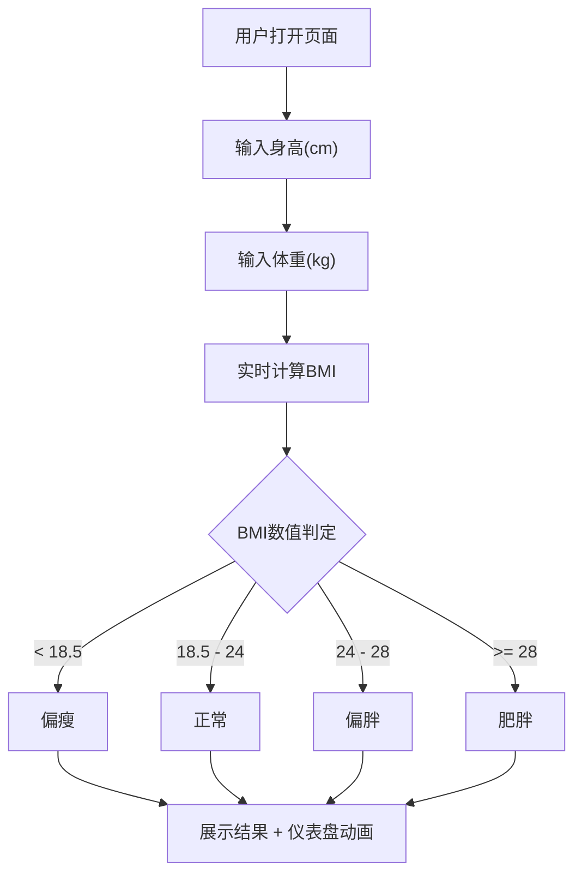

## 1. 产品概述

BMI计算器是一款简洁优雅的在线健康指标计算工具，帮助用户快速计算身体质量指数（BMI）并了解自身健康状况。
- 解决用户需要快速、直观地了解自身体重健康状况的需求
- 目标用户为关注健康的普通人群，提供即时反馈和健康建议

## 2. 核心功能

### 2.1 功能模块
1. **计算页**：身高/体重输入、BMI计算、结果展示、健康等级判定、可视化仪表盘

### 2.2 页面详情
| 页面名称 | 模块名称 | 功能描述 |
|----------|----------|----------|
| 计算页 | 输入区域 | 身高（cm）和体重（kg）输入框，支持实时计算 |
| 计算页 | 结果展示 | 显示BMI数值、健康等级、等级描述和建议 |
| 计算页 | 可视化仪表盘 | 半圆仪表盘动态展示BMI所在区间 |
| 计算页 | BMI参考表 | 展示各BMI区间的分类标准 |

## 3. 核心流程

用户打开页面 → 输入身高和体重 → 实时计算BMI → 展示结果和健康等级 → 仪表盘动画指向对应区间 → 显示健康建议

## 4. 用户界面设计

### 4.1 设计风格
- 主色调：深墨绿(#1a2f2a)搭配薄荷绿(#4ade80)点缀，营造健康自然感
- 辅助色：暖金色(#fbbf24)用于警示区间
- 按钮风格：圆角胶囊按钮，带微妙阴影和hover缩放效果
- 字体：使用 Outfit（标题）+ DM Sans（正文），现代简洁
- 布局风格：居中卡片式布局，背景带渐变和噪点纹理
- 图标风格：线条图标，配合柔和动画

### 4.2 页面设计概览
| 页面名称 | 模块名称 | UI元素 |
|----------|----------|--------|
| 计算页 | 输入区域 | 圆角输入框，带单位标签，聚焦时边框高亮 |
| 计算页 | 结果展示 | 大号BMI数值，彩色等级标签，渐变背景卡片 |
| 计算页 | 可视化仪表盘 | SVG半圆仪表盘，带动画指针，四色区间 |
| 计算页 | BMI参考表 | 简洁表格，当前区间高亮 |

### 4.3 响应式设计
- 桌面优先设计，移动端自适应
- 触控优化：输入框和按钮足够大的点击区域
