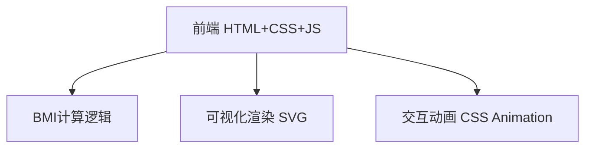

## 1. 架构设计

纯前端单页应用，无后端依赖。

## 2. 技术说明
- 前端：纯 HTML + CSS + JavaScript（单文件方案）
- 构建工具：无需构建，浏览器直接运行
- 后端：无
- 数据库：无

## 3. 路由定义
| 路由 | 用途 |
|------|------|
| / | BMI计算器主页面 |

## 4. 核心计算逻辑

BMI = 体重(kg) / 身高(m)²

| BMI范围 | 分类 | 颜色 |
|---------|------|------|
| < 18.5 | 偏瘦 | #60a5fa 蓝色 |
| 18.5 - 24 | 正常 | #4ade80 绿色 |
| 24 - 28 | 偏胖 | #fbbf24 金色 |
| >= 28 | 肥胖 | #f87171 红色 |

## 5. 技术实现要点
- SVG绘制半圆仪表盘，CSS transition驱动指针动画
- 输入框 input 事件实时触发计算
- CSS变量管理主题色
- 响应式布局使用 CSS Grid + Flexbox
- 背景使用CSS渐变+噪点纹理叠加
