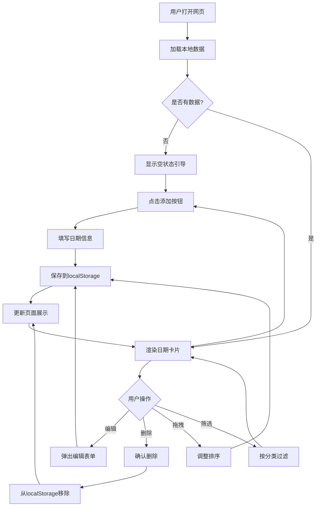

## 1. 产品概述

时光记是一款纯网页版倒数日/纪念日管理工具，采用极简清新、治愈系设计风格，帮助用户直观记录和追踪重要日期（生日、节日、deadline、纪念日等），无需登录即可使用，数据本地存储确保隐私安全。

- 目标用户：学生（考试/假期倒计时）、职场人（项目截止日/入职纪念日）、情侣/家人（恋爱纪念日/生日）、普通用户（节日/旅行计划）
- 核心价值：零门槛使用、轻量无广告、数据安全本地化、高自定义个性化

## 2. 核心功能

### 2.1 用户角色
无角色区分，所有用户平等使用全部功能，无需注册登录。

### 2.2 功能模块
1. **主页**：日期卡片展示区（网格/列表视图）、导航栏、悬浮添加按钮
2. **添加/编辑弹窗**：日期类型选择、标题输入、日期选择、分类设置、备注添加
3. **设置面板**：主题切换、显示偏好、通知设置、数据管理

### 2.3 页面详情

| 页面名称 | 模块名称 | 功能描述 |
|---------|---------|---------|
| 主页 | 顶部导航栏 | Logo + 视图切换按钮 + 排序下拉 + 设置入口 |
| 主页 | 日期卡片区域 | 网格/列表展示所有日期卡片，支持拖拽排序 |
| 主页 | 悬浮添加按钮 | 固定在右下角的高亮添加按钮，点击弹出添加表单 |
| 主页 | 分类筛选栏 | 横向滚动的分类标签，点击筛选对应分类 |
| 添加/编辑弹窗 | 表单区域 | 类型选择（倒数日/纪念日）、标题、日期、分类、备注 |
| 添加/编辑弹窗 | 操作按钮 | 保存/取消/删除（编辑模式下） |
| 设置面板 | 主题设置 | 浅色/深色/自定义背景图切换 |
| 设置面板 | 显示设置 | 隐藏已过期、卡片大小调整、默认排序方式 |
| 设置面板 | 通知设置 | 开关桌面通知、选择提醒时间（1天/3天/无） |
| 设置面板 | 数据管理 | 导出JSON、导入JSON、清除已过期、批量删除 |

## 3. 核心流程

### 3.1 添加日期流程
用户点击悬浮添加按钮 → 弹出表单弹窗 → 选择类型（倒数日/纪念日）→ 填写标题、选择日期、设置分类、添加备注 → 点击保存 → 卡片出现在主页 → Toast提示"添加成功"

### 3.2 编辑/删除流程
用户悬停（PC）或长按（移动端）卡片 → 显示编辑/删除图标 → 点击编辑弹出预填表单 / 点击删除弹出确认 → 操作完成 → Toast提示

### 3.3 数据管理流程
用户进入设置面板 → 选择导入/导出 → 导出：生成JSON文件下载 / 导入：选择JSON文件上传 → 数据合并/覆盖 → Toast提示

## 4. 用户界面设计

### 4.1 设计风格
- **主色调**：莫兰迪色系 — 淡蓝(#A8C5DA)、浅粉(#E8B4B8)、米白(#F5F0EB)
- **倒数日卡片**：淡蓝色系(#A8C5DA → #7BA7C2)，传达期待感
- **纪念日卡片**：浅粉色系(#E8B4B8 → #D4919A)，传达温暖感
- **强调色**：柔和珊瑚色(#E8927C)用于悬浮按钮和重要操作
- **背景色**：米白(#FAF8F5)浅色模式 / 深灰(#1A1A2E)深色模式
- **按钮风格**：圆角(12px)、微阴影、hover时轻微放大
- **字体**：标题使用 Nunito（圆润友好），正文使用 Noto Sans SC（清晰易读）
- **布局风格**：卡片式网格布局，顶部导航，响应式自适应
- **图标风格**：线性图标(Lucide)，2px描边，与整体极简风格统一

### 4.2 页面设计概览

| 页面名称 | 模块名称 | UI元素 |
|---------|---------|--------|
| 主页 | 顶部导航栏 | 固定顶部，毛玻璃背景，左侧Logo文字"时光记"，右侧视图切换图标+排序下拉+设置齿轮图标 |
| 主页 | 分类筛选栏 | 横向滚动标签行，选中态带底色，默认"全部"选中 |
| 主页 | 日期卡片网格 | 3列(PC)/2列(平板)/1列(手机)网格，卡片圆角16px，微阴影，hover放大1.03倍+阴影加深 |
| 主页 | 日期卡片 | 顶部分类色条(4px)，标题(加粗)、核心数字(超大加粗)、目标日期(小字灰色)、分类标签(胶囊形) |
| 主页 | 悬浮添加按钮 | 固定右下角，圆形56px，珊瑚色背景，白色加号图标，hover旋转45度 |
| 主页 | 空状态 | 居中插画+引导文字"点击右下角添加第一个重要日期" |
| 添加/编辑弹窗 | 弹窗主体 | 居中弹窗，圆角20px，毛玻璃背景，淡入动画 |
| 添加/编辑弹窗 | 类型切换 | 胶囊形切换器，倒数日(蓝)/纪念日(粉) |
| 添加/编辑弹窗 | 表单字段 | 圆角输入框，focus时边框变色，日期选择器原生样式 |
| 设置面板 | 面板主体 | 右侧滑出抽屉，宽度320px，毛玻璃背景 |
| 设置面板 | 主题切换 | 三个预览色块(浅色/深色/自定义)，选中态带勾 |
| 设置面板 | 开关控件 | 圆形滑块开关，开态为主题色 |

### 4.3 响应式设计
- **桌面优先**设计，逐步适配小屏
- **PC端**（≥1024px）：3列网格，hover交互，鼠标拖拽
- **平板端**（768-1023px）：2列网格，触摸友好
- **手机端**（<768px）：1列列表，触摸长按编辑，底部导航
- **最小宽度**：320px
- **触摸优化**：按钮最小点击区域44px，拖拽使用触摸事件

### 4.4 夜间模式
- 深色背景(#1A1A2E)，卡片背景(#252540)
- 文字色调整为浅色(#E8E6F0)
- 莫兰迪色系降低饱和度适配暗色
- 跟随系统偏好或手动切换
