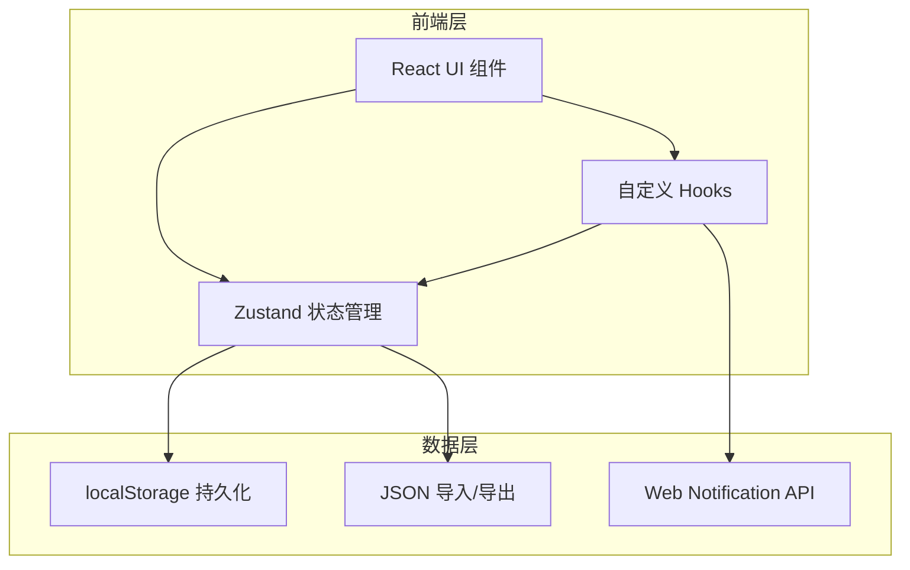
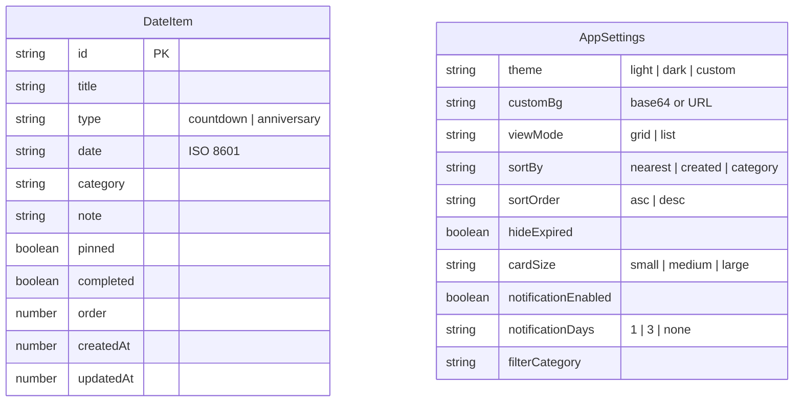

## 1. 架构设计



纯前端架构，无后端服务。React + Zustand 管理状态，localStorage 持久化数据，Web Notification API 实现桌面通知。

## 2. 技术说明

- **前端框架**：React 18 + TypeScript
- **构建工具**：Vite
- **样式方案**：Tailwind CSS 3 + CSS Variables（主题切换）
- **状态管理**：Zustand（轻量、简洁）
- **拖拽排序**：@dnd-kit/core + @dnd-kit/sortable
- **图标库**：lucide-react
- **字体**：Nunito（标题）+ Noto Sans SC（正文），Google Fonts CDN
- **数据存储**：localStorage（JSON序列化）
- **通知**：Web Notification API（浏览器原生）
- **无后端**：纯客户端应用

## 3. 路由定义

| 路由 | 用途 |
|------|------|
| / | 主页，展示所有日期卡片 |

单页应用，所有功能通过弹窗/抽屉/面板在主页内完成，无需多路由。

## 4. 数据模型

### 4.1 数据模型定义



### 4.2 数据定义

**DateItem 接口：**
```typescript
interface DateItem {
  id: string;           // UUID
  title: string;        // 标题
  type: 'countdown' | 'anniversary';  // 倒数日 | 纪念日
  date: string;         // 目标日期 ISO格式
  category: string;     // 分类：birthday | holiday | work | life | custom
  note: string;         // 备注
  pinned: boolean;      // 是否置顶
  completed: boolean;   // 是否标记完成
  order: number;        // 排序序号
  createdAt: number;    // 创建时间戳
  updatedAt: number;    // 更新时间戳
}
```

**AppSettings 接口：**
```typescript
interface AppSettings {
  theme: 'light' | 'dark' | 'custom';
  customBg: string;     // 自定义背景图(base64/URL)
  viewMode: 'grid' | 'list';
  sortBy: 'nearest' | 'created' | 'category';
  sortOrder: 'asc' | 'desc';
  hideExpired: boolean;
  cardSize: 'small' | 'medium' | 'large';
  notificationEnabled: boolean;
  notificationDays: '1' | '3' | 'none';
  filterCategory: string;
}
```

**localStorage 键：**
- `timekeeper_dates`：DateItem[] 序列化JSON
- `timekeeper_settings`：AppSettings 序列化JSON

## 5. 项目目录结构

```
时光记/
├── src/
│   ├── components/
│   │   ├── DateCard.tsx          # 日期卡片组件
│   │   ├── DateCardGrid.tsx      # 卡片网格/列表容器
│   │   ├── AddEditModal.tsx      # 添加/编辑弹窗
│   │   ├── SettingsDrawer.tsx    # 设置抽屉面板
│   │   ├── CategoryFilter.tsx    # 分类筛选栏
│   │   ├── Navbar.tsx            # 顶部导航栏
│   │   ├── EmptyState.tsx        # 空状态组件
│   │   ├── Toast.tsx             # Toast提示组件
│   │   └── ConfirmDialog.tsx     # 确认对话框
│   ├── hooks/
│   │   ├── useTheme.ts           # 主题切换hook
│   │   ├── useNotification.ts    # 通知hook
│   │   └── useDragSort.ts        # 拖拽排序hook
│   ├── pages/
│   │   └── Home.tsx              # 主页
│   ├── utils/
│   │   ├── dateCalc.ts           # 日期计算工具
│   │   └── storage.ts            # localStorage工具
│   ├── App.tsx                   # 根组件
│   ├── index.css                 # 全局样式+CSS变量
│   ├── main.tsx                  # 入口
│   ├── store.ts                  # Zustand状态管理
│   ├── types.ts                  # TypeScript类型定义
│   └── vite-env.d.ts
├── public/
│   └── favicon.svg
├── index.html
├── package.json
├── vite.config.ts
├── tailwind.config.js
├── postcss.config.js
└── tsconfig.json
```
